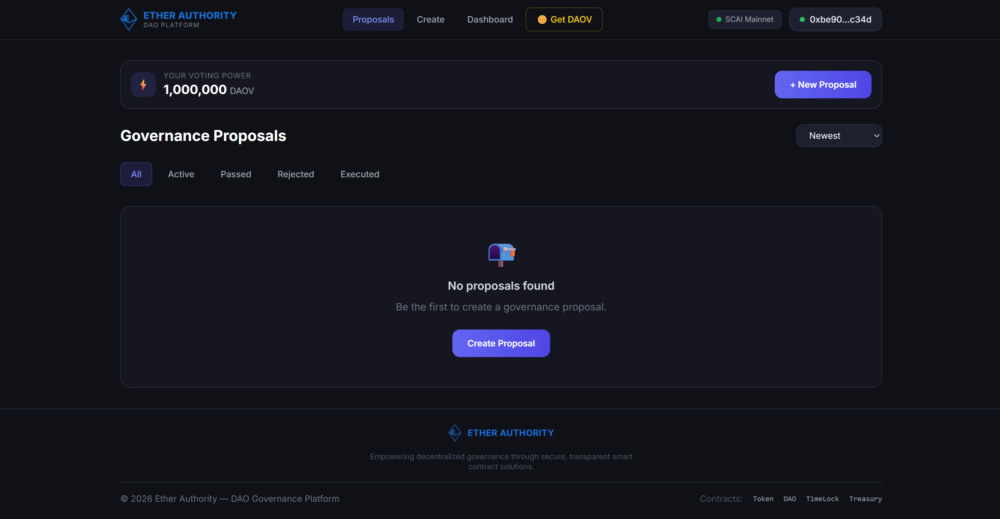
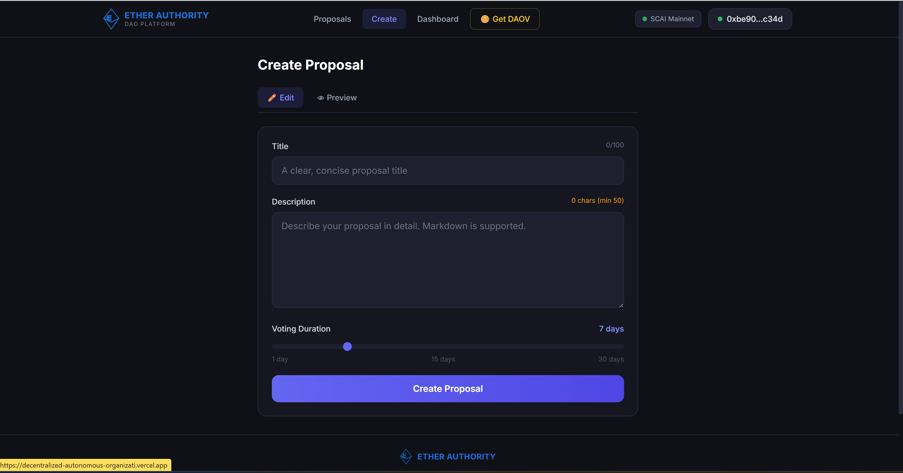

# 🏛️ Decentralized Autonomous Organization (DAO) Platform

A comprehensive, full-stack DAO Governance Platform built with Solidity, React, and Ethers.js. This platform allows communities to create proposals, vote on them using a governance token (DAOV), and automatically execute passed proposals via a TimeLock-secured Treasury.

## 🌟 Features

*   **Custom Governance Engine:** A bespoke `GovernanceDAO` contract handling proposal lifecycles, voting logic, and state transitions.
*   **Token-Weighted Voting:** Voting power is determined by the balance of `DAOVote (DAOV)` ERC-20 tokens held by the user.
*   **Time-Delayed Execution:** All approved proposals must pass through a `TimeLock` queue with a mandatory delay, ensuring security and time for users to react before execution.
*   **Secure Treasury:** A `Treasury` contract that holds ETH and ERC-20 tokens, with withdrawals strictly restricted to the TimeLock contract.
*   **Modern Frontend:** A sleek, responsive React 18 application built with Vite, TailwindCSS (dark theme glassmorphism), and Ethers.js v6.
*   **Multi-Network Support:** Configured for local development (Hardhat), Ethereum Sepolia, and SecureChain AI (SCAI) Mainnet.

## 🏗️ Architecture

The system consists of four core smart contracts working in tandem:

1.  **`GovernanceToken.sol` (DAOV):** An ERC-20 token with `ERC20Permit` support used to represent voting power in the DAO.
2.  **`GovernanceDAO.sol`:** The core engine. Users with sufficient tokens can create proposals. Members vote `For` or `Against`. If a proposal passes, it is sent to the TimeLock.
3.  **`TimeLock.sol`:** Implements `AccessControl`. Enforces a minimum delay (e.g., 2 days) between a proposal passing and its execution. The DAO contract acts as the `PROPOSER`, queuing successful votes.
4.  **`Treasury.sol`:** The DAO's vault. It receives funds from anywhere but only allows the `TimeLock` address to initiate withdrawals or execute arbitrary transactions.

### Proposal Lifecycle
`Draft` ➡️ `Active` ➡️ `Passed/Rejected` ➡️ `Queued (TimeLock)` ➡️ `Executed`

## 🛠️ Tech Stack

**Smart Contracts & Backend:**
*   Solidity `^0.8.20`
*   OpenZeppelin Contracts `v5.0.2` (Targeting `paris` EVM for broad compatibility)
*   Hardhat & Ethers.js v6
*   Chai for Integration Testing

**Frontend:**
*   React 18 & TypeScript
*   Vite
*   TailwindCSS & PostCSS
*   React Router v6
## 📸 Screenshots

### Governance Proposals Dashboard


### Create Proposal Interface


## 🌐 Deployed Contracts

### SecureChain AI (SCAI) Mainnet (Chain ID: 34)
*   **GovernanceToken:** `0x78B9f07beb9e8510393e4B4631590baA988Af8aa`
*   **TimeLock:** `0x054890e3A9e48De13A41bD375045E5a1d9145170`
*   **Treasury:** `0xEe993650Aa439206D2ec0725413AfE3B9e74b37C`
*   **GovernanceDAO:** `0xADF4471EFA9dfd43B83ea8278652b60c0b419777`
*   *Explorer:* [explorer.securechain.ai](https://explorer.securechain.ai)

### Ethereum Sepolia Testnet (Chain ID: 11155111)
*   **GovernanceToken:** `0xd6D587A139b425Fc63F5819eFEF19Eef5442edee`
*   **TimeLock:** `0xf86AFdcFC6CD9F1341903B2E25239e627C9e452E`
*   **Treasury:** `0xb44013f8D20a6DafDb32DDB83B5a2A82E310697A`
*   **GovernanceDAO:** `0xBF86466b1141b0cfF632bEc6750d2cf7781Def20`

## 🚀 Getting Started (Local Development)

### Prerequisites
*   Node.js `v18+`
*   npm or yarn

### 1. Installation
Clone the repository and install dependencies in the root directory and frontend:
```bash
# Install smart contract dependencies
npm install

# Install frontend dependencies
cd frontend
npm install
cd ..
```

### 2. Environment Setup
Copy `.env.example` to `.env` in the root directory:
```bash
cp .env.example .env
```
Fill in the required values in `.env`:
*   `PRIVATE_KEY`: Your deployer wallet private key.
*   `ALCHEMY_SEPOLIA_URL` / `SCAI_RPC_URL`: RPC endpoints.
*   `ETHERSCAN_API_KEY`: For contract verification.
*   `VITE_*`: Frontend configuration variables (updated automatically after deployment).

### 3. Local Node & Deployment
Start a local Hardhat node in one terminal:
```bash
npx hardhat node
```

In a second terminal, compile and deploy the contracts locally:
```bash
npm run compile
npm run deploy:local
```
*Note: The deployment script outputs the deployed addresses and automatically saves them to `deployments/localhost.json`. Update your `.env` file's `VITE_` variables with these local addresses for testing.*

### 4. Run the Frontend
Navigate to the frontend directory and start the Vite development server:
```bash
cd frontend
npm run dev
```
Open `http://localhost:5173` in your browser. Connect MetaMask (ensure it's connected to your local Hardhat network `http://127.0.0.1:8545`).

## 🧪 Testing

The project includes comprehensive integration tests covering happy paths, edge cases, and TimeLock execution flows.

```bash
# Run the test suite
npm run test

# Generate a test coverage report
npm run test:coverage
```

## 📜 Available Scripts

*   `npm run compile`: Compiles Solidity contracts.
*   `npm run test`: Runs Mocha/Chai tests.
*   `npm run deploy:local`: Deploys to local Hardhat network.
*   `npm run deploy:sepolia`: Deploys to Sepolia testnet.
*   `npm run deploy:scai`: Deploys to SCAI Mainnet.
*   `npm run verify:sepolia`: Verifies contracts on Etherscan.
*   `npm run verify:scai`: Verifies contracts on SCAI explorer.
*   `npm run dev`: Starts the frontend development server.

## 📄 License

This project is licensed under the MIT License.

---

## 🎓 Ether Authority Internship Portfolio

This repository serves as the final capstone project for the Ether Authority Web3 Internship. Throughout the program, the following smart contracts and full-stack dApps were successfully developed and deployed:

**Completed Projects:**
* Hello World
* Counter (Smart Contract + React App)
* Storage
* Ownable
* Ether Transfer
* Student Registration
* Voting Contracts
* React Apps (Todo, Form, API Fetch)
* **Full-Stack DAO Governance Platform (This repository)**

**Company Mentions:** 
@EtherAuthority @SecurechainAI

**Hashtags:**
#Web3 #Blockchain #Ethereum #ReactJS #SmartContracts #SCAI #Internship #Solidity #SecureChainAI #EtherAuthority
